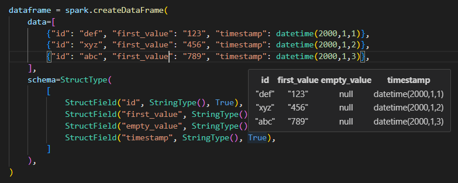

# pyspark-dataframe-visualizer

This VS Code extension displays a pyspark dataframe, formatted as a table when you hover over it!

## How to install

* Clone this repository.
* Open the repository in vscode
* In the terminal, run ```code --install-extension releases/pyspark-dataframe-visualizer-0.0.1.vsix```

## Features

When writing tests for pyspark, you often create small dataframes. When these dataframes become a bit larger,
it's easy to lose the oversight of what the dataframe looks like. When this extension is installed,
hovering over your dataframe definition displays the dataframe as a nicely formatted table.

You can define your dataframes using a list of tuples:


Or using a list of dictionaries:




## Known issues

* The schema of your dataframe has to be defined using a StructType.
* Using variables in the definition of your dataframe is not supported yet.
* White spaces in the cell values of your dataframe are not supported yet.


